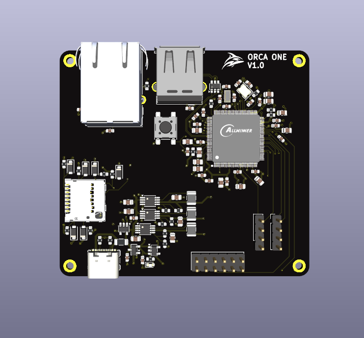
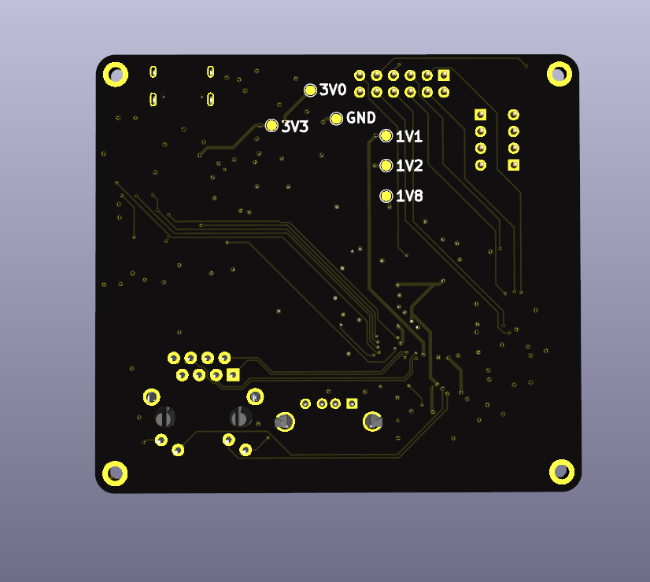
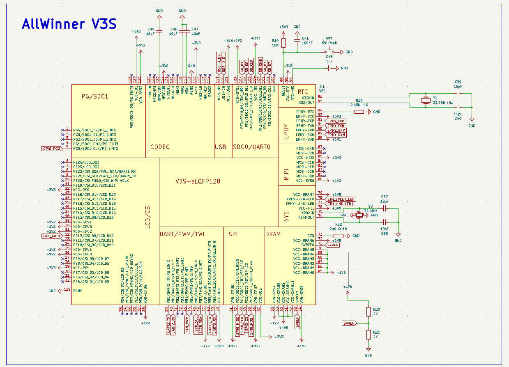
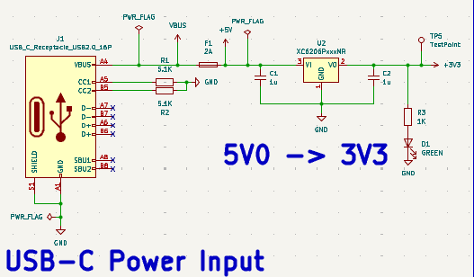
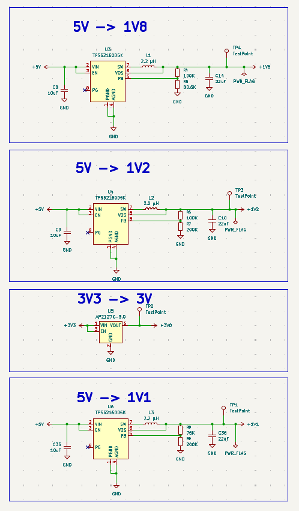
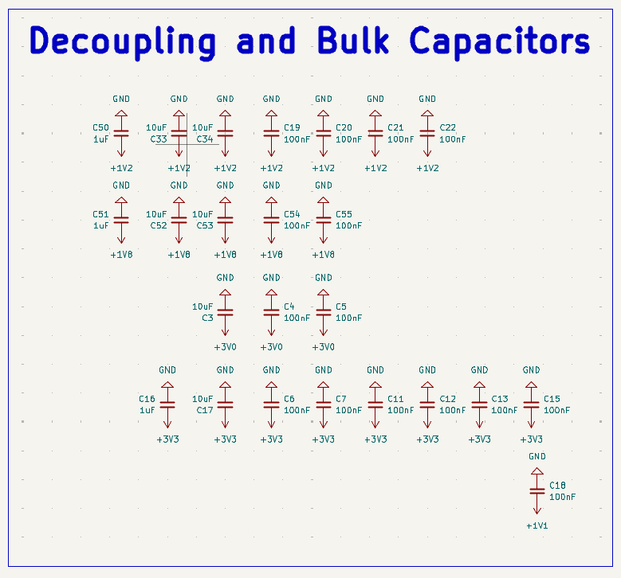
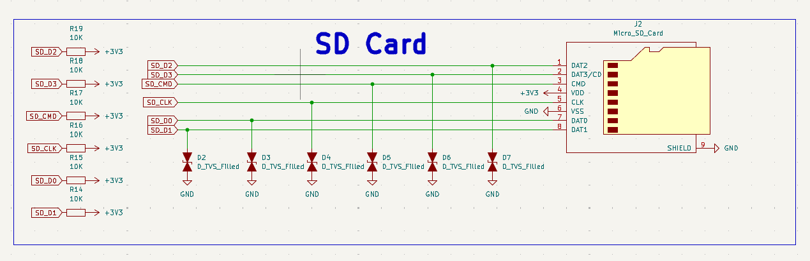
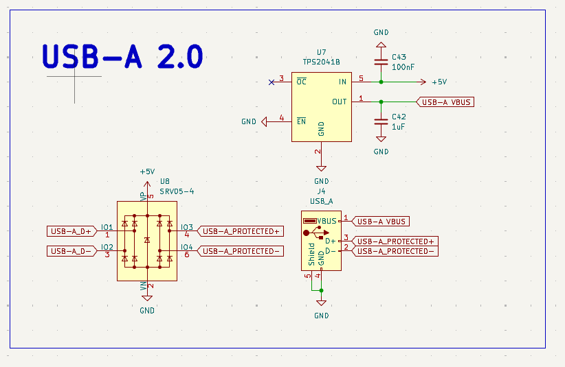
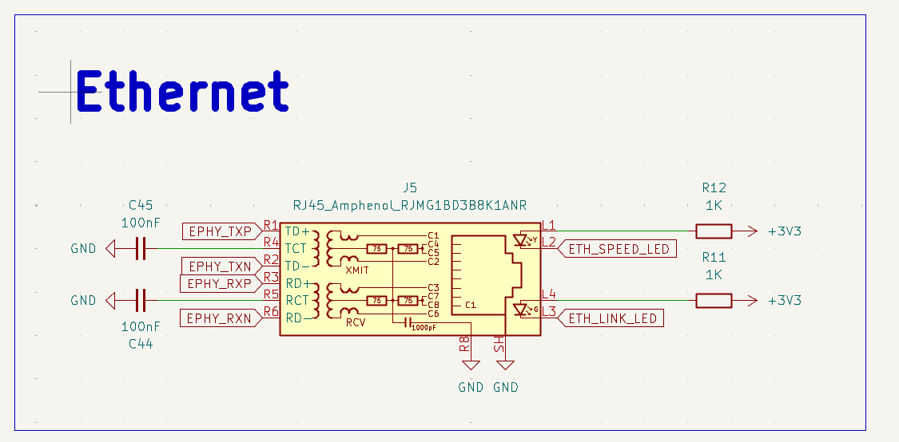
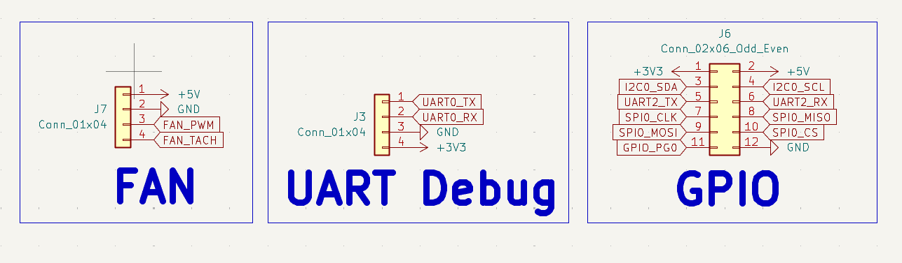

# Orca One V1.0

### A custom Allwinner V3s single-board computer

Hardware design · PCB layout · ORCA OS testing · Bring-up documentation

> [!IMPORTANT]
> **Proprietary design — all rights reserved.** The files are public for viewing and evaluation only. No permission is granted to manufacture, copy, modify, redistribute, or sell this design. See the [license](LICENSE) for the complete terms.

> [!WARNING]
> **Early hardware revision.** Orca One V1.0 has not been manufactured or tested yet. The board is currently waiting on funding before manufacturing.

## What is Orca One?

Orca One is the first test board for Orca servers. The main purpose of the board is to give us our own hardware to start testing ORCA OS on.

The first goal is simple: get our lightweight Linux-based ORCA OS to successfully boot on hardware we designed ourselves. This board is not meant to be a powerful Orca server yet. It is a starting point for testing the hardware and software before moving onto more complicated boards.

## Board renders

| Front | Back |
| :---: | :---: |
|  |  |

## Why I chose the Allwinner V3s

I chose the Allwinner V3s because it is a relatively easy and cheap chip to start with.

One of the biggest reasons was its package. The V3s uses an LQFP package instead of BGA, which makes the PCB easier to design and also makes the chip easier to solder.

It also has integrated RAM instead of requiring external DDR. This means I don't have to route a separate DDR chip for my first Linux board, while I can still get experience designing a board around a Linux-capable SoC.

## Main features

- Allwinner V3s SoC with integrated RAM
- 5 V USB-C power input
- 3.3 V, 3.0 V, 1.8 V, 1.2 V and 1.1 V power rails
- MicroSD storage and OS boot
- USB-A 2.0
- Ethernet
- GPIO expansion
- UART debugging
- Fan header
- Four-layer custom PCB

## Power system

The board is powered using 5 V over USB-C. The USB-C input is configured as a power sink using two 5.1 kΩ resistors on the CC pins.

From the 5 V input, the board generates the different voltages required by the V3s and the other parts of the board. These include 3.3 V, 3.0 V, 1.8 V, 1.2 V and 1.1 V.

I decided to design this power system instead of using a premade power module because I wanted to learn and get practice using power regulators and buck converters.

One of the main things I had to learn was how adjustable regulators use a feedback voltage divider. I had to use the regulator equations to work out the resistor values needed to generate the correct output voltages.

This was probably the hardest part of designing the schematic because it involved both understanding the circuit and doing the maths to make sure each rail had the correct voltage.

## Decoupling and bulk capacitors

Another part of the power design was adding the decoupling and bulk capacitors for the different rails.

This became one of the hardest parts when I moved onto the PCB layout. I needed to fit the capacitors close to the V3s power pins while still leaving enough room around the SoC to route everything else.

## MicroSD and ORCA OS

Orca One does not have any other onboard storage, so the MicroSD card is used to store and boot ORCA OS.

The first major software test for the physical board will be seeing if our OS can successfully boot from the MicroSD card.

## USB 2.0

Orca One has a USB-A 2.0 port for connecting USB devices to the board.

## Ethernet

Ethernet was added so Orca One can be managed remotely over the network using SSH.

This means that once ORCA OS is running, I should be able to connect to the board from another computer and manage it without needing a display or keyboard connected directly to Orca One.

## GPIO, UART and fan

The board also has headers for GPIO, UART and a fan.

UART gives me a way to debug the board, especially during the first boot attempts. The GPIO header exposes connections from the V3s for future testing and expansion, while the fan header gives the board a connection for cooling if needed.

## PCB layout

After completing the schematic, I moved onto designing the four-layer PCB.

One of the most difficult parts was placing the decoupling and bulk capacitors close to the SoC while also making sure there was enough room to route the rest of the board.

I also spent a lot of time working on the copper pours. The pours were changed many times during the PCB design as I worked out better ways to shape and position them around the board.

This ended up being one of the biggest things I learned from designing Orca One. Before this project I had much less experience using copper pours, but I now have a much better understanding of how to use and adjust them as part of a PCB layout.

## What I learned

Orca One has given me practice designing a complete board around a Linux-capable SoC instead of only working with individual smaller circuits.

Some of the main things I learned while making the board were:

- How to use and shape copper pours
- How to design multiple power rails
- How adjustable regulators and buck converters work
- How to calculate feedback voltage dividers
- How to place decoupling and bulk capacitors around an SoC
- How to design a board around a processor with multiple interfaces
- How the hardware and boot storage need to work together to boot an operating system

The biggest thing I learned during the PCB layout was how to use copper pours properly. I changed them several times while designing the board and gradually found better ways to fit them into the layout.

## Current status

Orca One V1.0 is currently waiting on funding before it can be manufactured.

Because the physical board does not exist yet, none of the hardware has been validated. The next major stage of the project is manufacturing and bring-up.

## First bring-up

Once the board has been manufactured and assembled, the first thing I want to find out is whether it powers on correctly.

After that, the main goal is to see if it can successfully boot ORCA OS from the MicroSD card.

Getting the board to power on and boot our own OS will be the first major test of Orca One and will let us start testing the hardware and software together.

## Design overview

The complete editable schematic is included in the KiCad project. Expand a section below for a quick visual tour.

<strong>Power system</strong> — USB-C input and regulated power rails

### USB-C power input

### Regulated power rails

<strong>External interfaces</strong> — USB-A, MicroSD, and Ethernet

### USB-A 2.0

### MicroSD card

### Ethernet

<strong>Processor and supporting circuitry</strong> — Allwinner V3s and decoupling

### Allwinner V3s

### Decoupling and bulk capacitors

<strong>Expansion and debug</strong> — fan, UART, and GPIO headers

## Repository contents

| Path | Contents |
| --- | --- |
| `hardware/kicad/` | KiCad 9 project, schematic, and four-layer PCB layout |
| `hardware/footprints/` | Custom Allwinner V3s LQFP-128 footprint |
| `bom/` | Bill of materials in CSV and XLSX formats |
| `manufacturing/` | Gerber/drill archive and component placement data |
| `images/` | Board photographs, schematic images and renders |

## Opening the design

1. Install KiCad 9 or a compatible newer release.
2. Open `hardware/kicad/ORCA First Linux Board.kicad_pro`.
3. The project-local footprint table maps the included `v3s` footprint library automatically.

The PCB currently references three optional component STEP models from the original designer's local computer, including the V3s processor and Ethernet connector models. They are not included, so KiCad may show those packages without 3D bodies until redistributable models are added.

## Manufacturing warning

Review the schematic, PCB, BOM, placement data, and fabrication outputs carefully before ordering or assembling boards.

This is the first hardware revision and has not yet been physically tested. Manufacturing outputs may also become stale as the editable design changes.

## License

Copyright © 2026 Finn Mather. All rights reserved. This is **not an open-source hardware project**. See [LICENSE](LICENSE) for the complete proprietary terms and instructions for requesting permission.
